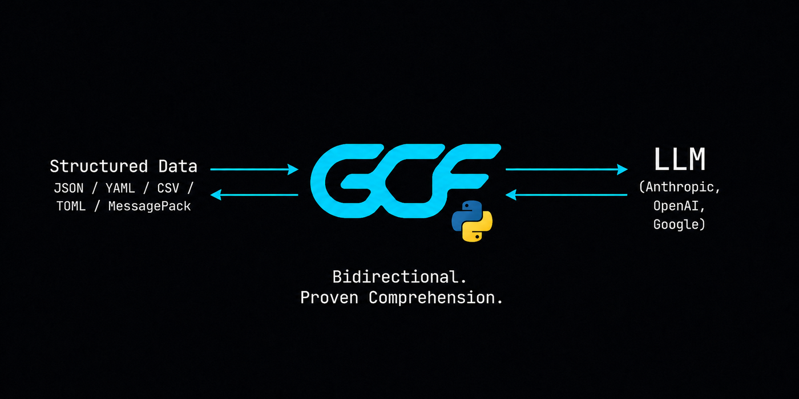

<p align="center">
  <a href="https://gcformat.com/playground.html"></a>
  <a href="https://gcformat.com/guide/benchmarks.html"></a>
  <a href="https://pypi.org/project/gcf-python/"></a>
  <a href="LICENSE"></a>
</p>

<p align="center">
  
</p>

# gcf-python

Python implementation of [GCF](https://gcformat.com/), the most token-efficient wire format for LLMs. A drop-in alternative to JSON and TOON for any structured data.

<p align="center">
  
</p>

<p align="center">
  
</p>

<p align="center">
  
</p>

**Built for the agentic loop, where the same structured context crosses the model boundary turn after turn.** A single payload is 50-92% smaller than JSON, but GCF also deduplicates repeated structure across turns and sends only deltas when context changes, so by the 5th overlapping call each response costs 99% fewer tokens than JSON, and a 10-call session runs 94.4% cheaper than re-sending JSON every turn. Session dedup and delta both need local IDs and a multi-turn design that neither JSON nor TOON has.

- **100% comprehension on every frontier model**, zero training. 29% fewer tokens than TOON and 56% fewer than JSON across 16 datasets; 91.2% on structurally complex code graphs (vs TOON 68.8%, JSON 54.1%).
- **Proven lossless** across 43,000,000,000+ round-trips in 5 formats and 6 languages. Zero runtime dependencies.
- **One format, four properties no other single format holds at once:** schema-free, lossless, token-compact (50-92% vs JSON), and model-readable with zero training. JSON is verbose, Protobuf needs a schema, MessagePack is binary, and TOON isn't reliably lossless.

2,500+ LLM evaluations. [Full benchmarks](https://gcformat.com/guide/benchmarks.html).

Docs: [gcformat.com](https://gcformat.com/) · [Playground](https://gcformat.com/playground.html) · [GCF vs TOON](https://gcformat.com/guide/vs-toon.html)

## Install

```
pip install gcf-python
```

Zero dependencies. Pure Python. Python 3.9+. Includes CLI. Don't want to change code? Use the [MCP proxy](https://github.com/blackwell-systems/gcf-proxy) for zero-code adoption.

## CLI

```bash
gcf encode < payload.json    # JSON to GCF
gcf decode < payload.gcf     # GCF to JSON
gcf stats  < payload.json    # token comparison with visual bar
```

```
Payload: 50 symbols, 20 edges

  JSON  ██████████████████████████████  4,200 tokens
  GCF   ████████░░░░░░░░░░░░░░░░░░░░░░  1,150 tokens

  Savings: 73% fewer tokens with GCF
```

## Library

### Quick Start

```python
from gcf import encode_generic

output = encode_generic({
    "employees": [
        {"id": 1, "name": "Alice", "department": "Engineering", "salary": 95000},
        {"id": 2, "name": "Bob", "department": "Sales", "salary": 72000},
    ],
})
```

Output:
```
## employees [2]{id,name,department,salary}
1|Alice|Engineering|95000
2|Bob|Sales|72000
```

## Decode

```python
from gcf import decode

p = decode(input_text)
print(p.tool, len(p.symbols), "symbols", len(p.edges), "edges")
```

## Session Deduplication

Track transmitted symbols across multiple tool responses. Previously-sent symbols become bare references instead of full declarations:

```python
from gcf import encode_with_session, Session, Payload, Symbol

sess = Session()

out1 = encode_with_session(payload1, sess)  # full declarations
out2 = encode_with_session(payload2, sess)  # reused symbols as "@N  # previously transmitted"
```

By the 5th call in a session: 86% fewer tokens than JSON from dedup alone, 99% stacked with delta encoding.

## Streaming Encode

Write GCF output incrementally as symbols and edges arrive. Zero buffering, O(1) memory per row:

```python
from gcf import StreamEncoder, Symbol, Edge

enc = StreamEncoder(sys.stdout, "context_for_task", token_budget=5000)

enc.write_symbol(Symbol(qualified_name="pkg.Auth", kind="function", score=0.95, provenance="lsp", distance=0))
enc.write_symbol(Symbol(qualified_name="pkg.Server", kind="function", score=0.60, provenance="lsp", distance=1))
enc.write_edge(Edge(source="pkg.Server", target="pkg.Auth", edge_type="calls"))
enc.close()  # emits ##! summary trailer
```

Output:
```
GCF tool=context_for_task budget=5000
## targets
@0 fn pkg.Auth 0.95 lsp
## related
@1 fn pkg.Server 0.60 lsp
## edges [?]
@0<@1 calls
##! summary symbols=2 edges=1 counts=1,1,1
```

The writer is any object with a `write(s: str)` method. Thread-safe. Standard `decode()` handles streaming output with no changes.

## Delta Encoding

When the consumer already has a prior context pack, send only what changed:

```python
from gcf import encode_delta, DeltaPayload, Symbol, Edge

delta = DeltaPayload(
    tool="context_for_task",
    base_root="aaa111",
    new_root="bbb222",
    removed=[Symbol(qualified_name="pkg.OldFunc", kind="function")],
    added=[Symbol(qualified_name="pkg.NewFunc", kind="function", score=0.85, provenance="rwr")],
    delta_tokens=30,
    full_tokens=200,
)

output = encode_delta(delta)
```

81.2% savings on re-queries where the pack changed slightly.

## Generic Encoding

Encode any Python value (not just graph payloads) into GCF tabular format:

```python
from gcf import encode_generic

output = encode_generic({
    "employees": [
        {"id": 1, "name": "Alice", "department": "Engineering", "salary": 95000},
        {"id": 2, "name": "Bob", "department": "Sales", "salary": 72000},
    ],
})
```

Output:
```
## employees [2]{id,name,department,salary}
1|Alice|Engineering|95000
2|Bob|Sales|72000
```

Works on dicts, lists, and primitives. Lists of uniform dicts get tabular rows. Nested dicts use `## key` section headers.

## Generic-Profile Delta (multi-turn)

In an agent loop the same keyed table gets re-queried turn after turn. Instead of re-sending the whole table each time, send only the changed rows (SPEC §10a):

```python
from gcf import GenericSet, diff_generic_sets, encode_generic_delta, verify_generic_delta

base = GenericSet(key="id", fields=["id", "status"], rows=[
    {"id": 1001, "status": "pending"},
    {"id": 1002, "status": "shipped"},
])
nxt = GenericSet(key="id", fields=["id", "status"], rows=[
    {"id": 1001, "status": "shipped"},   # changed
    {"id": 1003, "status": "pending"},   # added (1002 removed)
])

d = diff_generic_sets(base, nxt)
wire = encode_generic_delta(d)                       # ## added / ## changed / ## removed
held = verify_generic_delta(base, d, d.new_root)     # atomic apply + new_root verification
```

Opt-in and bilateral, keyed on content-addressed pack roots. By the 5th overlapping call, ~97% fewer tokens than re-sending JSON.

### Re-anchor session helper

`GenericDeltaSession` manages the delta/re-anchor cadence for you: each `next()` returns either a compact delta or, on its cadence, a full re-anchor (which re-grounds the consumer), updating its held base.

```python
from gcf import GenericDeltaSession, fixed_n, size_guard

sess = GenericDeltaSession(base, tool="orders", policy=size_guard())
wire = sess.current_full()                # transmit the base once to establish it
for snapshot in stream:                   # each turn's current GenericSet
    wire, is_full = sess.next(snapshot)    # a compact delta, or a periodic full re-anchor
```

`fixed_n(15)` re-anchors every N turns; `size_guard()` (recommended) re-anchors once the cumulative delta reaches a full payload's size. It introduces no new wire syntax and the decoder stays cadence-agnostic, so a re-anchor is just the protocol's "full" outcome on a schedule.

## API

| Function | Description |
|----------|-------------|
| `encode(p: Payload) -> str` | Encode a graph payload to GCF text |
| `encode_generic(data: Any) -> str` | Encode any value to GCF tabular format |
| `decode(input_text: str) -> Payload` | Parse GCF text back to a Payload |
| `encode_with_session(p: Payload, s: Session) -> str` | Encode with session deduplication |
| `encode_delta(d: DeltaPayload) -> str` | Encode a graph delta (added/removed only) |
| `diff_generic_sets(base, next) -> GenericDeltaPayload` | Diff two keyed record sets (generic profile) |
| `encode_generic_delta(d) -> str` / `decode_generic_delta(s)` | Generic-profile delta wire (§10a) |
| `verify_generic_delta(base, d, root) -> GenericSet` | Atomic apply + `new_root` verification |
| `GenericDeltaSession(base, tool, policy)` | Producer-side re-anchor cadence helper (§10a.8) |
| `Session()` | Create a new session tracker (thread-safe) |

## Types

| Type | Purpose |
|------|---------|
| `Payload` | Full GCF payload: tool, budget, symbols, edges, pack root |
| `Symbol` | Graph node: qualified name, kind, score, provenance, distance |
| `Edge` | Directed relationship: source, target, edge type |
| `DeltaPayload` | Diff between two graph packs: added/removed symbols and edges |
| `GenericSet` / `GenericDeltaPayload` | Keyed record set and its generic-profile diff (§10a) |
| `GenericDeltaSession` | Stateful producer that schedules delta vs full re-anchor (§10a.8) |
| `Session` | Thread-safe tracker for multi-call deduplication |
| `KIND_ABBREV` / `KIND_EXPAND` | Bidirectional kind abbreviation dicts |

## Benchmarks

2,500+ LLM evaluations across 11 models, 4 providers, and 50+ independent test runs.

| | GCF | TOON | JSON |
|---|---|---|---|
| **Comprehension** (23 runs, 10 models) | **91.2%** | 68.8% | 54.1% |
| **Generation** (28 runs, 9 models) | **5/5** | 1.0/5 | 5.0/5 |
| **Input tokens** (500 symbols) | **11,090** | 16,378 | 53,341 |
| **Output tokens** (100 symbols) | **5,976** | 8,937 | 16,121 |

GCF wins 15/16 datasets on the expanded [token efficiency benchmark](https://github.com/blackwell-systems/toon/tree/gcf-comparison). Full results: [gcformat.com/guide/benchmarks](https://gcformat.com/guide/benchmarks.html)

## Implementations

| Language | Package | Repository |
|----------|---------|-----------|
| Go | `go get github.com/blackwell-systems/gcf-go` | [gcf-go](https://github.com/blackwell-systems/gcf-go) |
| TypeScript | `npm install @blackwell-systems/gcf` | [gcf-typescript](https://github.com/blackwell-systems/gcf-typescript) |
| Python | `pip install gcf-python` | [gcf-python](https://github.com/blackwell-systems/gcf-python) |
| Rust | `cargo add gcf` | [gcf-rust](https://github.com/blackwell-systems/gcf-rust) |
| Swift | Swift Package Manager | [gcf-swift](https://github.com/blackwell-systems/gcf-swift) |
| Kotlin | JitPack | [gcf-kotlin](https://github.com/blackwell-systems/gcf-kotlin) |
| MCP Proxy | `pip install gcf-proxy` | [gcf-proxy](https://github.com/blackwell-systems/gcf-proxy) (bidirectional, session dedup, HTTP frontend) |
| Claude Code Plugin | `/plugin install` | [gcf-claude-plugin](https://github.com/blackwell-systems/gcf-claude-plugin) (one-command install, session stats hook) |
| Codex Plugin | `codex plugin add` | [gcf-codex-plugin](https://github.com/blackwell-systems/gcf-codex-plugin) (one-command install, session stats hook) |
| VS Code | `ext install blackwell-systems.gcf-vscode` | [gcf-vscode](https://marketplace.visualstudio.com/items?itemName=blackwell-systems.gcf-vscode) (syntax highlighting) |
| n8n | `npm install n8n-nodes-gcf` | [gcf-n8n-nodes](https://github.com/blackwell-systems/gcf-n8n-nodes) (workflow encode/decode) |
| Tree-sitter | `npm install tree-sitter-gcf` | [tree-sitter-gcf](https://github.com/blackwell-systems/tree-sitter-gcf) |

**Zero runtime dependencies. Permanently.** All six implementations depend only on their language's standard library. No transitive dependencies. No supply chain risk. This is a permanent commitment: GCF will never take on external runtime dependencies. MIT licensed. All implementations support both generic profile (`encodeGeneric`) and graph profile (`encode`). CLI included in all 6 languages.

**Specification:** [SPEC v3.4.1 Stable](https://github.com/blackwell-systems/gcf/blob/main/SPEC.md) with 204 conformance fixtures, 43,000,000,000+ lossless round-trips verified across 5 formats and 6 languages. All implementations at v2.4.0+ (Go v1.5.0). Cross-language 6x6 matrix verified.

## Adopted by

| Project | |
|---------|--|
| **[Chrome DevTools MCP](https://github.com/ChromeDevTools/chrome-devtools-mcp)** | 47K★ · the Google Chrome DevTools team's MCP server; exposes live browser state (DOM, network, console, performance) to AI coding agents |
| **[Speakeasy](https://speakeasy.com)** | OpenAPI tooling (customers include Google, Verizon, Mistral AI, DocuSign, Vercel); GCF is a native output format in their `oq` CLI |
| **[OmniRoute](https://omniroute.online)** | 17K★ · AI gateway, registry, and proxy between AI clients and model providers; GCF vendored into its compression engine |
| **[NetClaw](https://github.com/automateyournetwork/netclaw)** | 610★ · AI-powered network automation (113 skills, 66 MCP integrations); replaced TOON with GCF across every MCP server |
| **[ctx](https://github.com/stevesolun/ctx)** | 552★ · real-time context selector for Claude Code; surfaces only the relevant tools from a 103K-node knowledge graph |
| **[Lynkr](https://github.com/Fast-Editor/Lynkr)** | 531★ · local LLM gateway for AI coding clients; GCF as a drop-in tool-result compressor alongside TOON |
| **[Open Data Products SDK](https://opendataproducts.org/sdk/)** | Linux Foundation · Python toolkit and MCP server for data-product standards; GCF sidecars for agent context |
| **[NeuroNest](https://neuronest.cc)** | agent-first IDE; first commercial GCF adoption, across four encoding surfaces with session dedup and delta |
| **[Raycast](https://raycast.com/blackwell-systems/json-to-gcf-converter)** | JSON-to-GCF Converter extension in the Raycast Store, for the macOS productivity launcher |

[See all adopters →](https://gcformat.com/ecosystem/adopters.html)

## License

MIT - [Dayna Blackwell](https://github.com/blackwell-systems)
